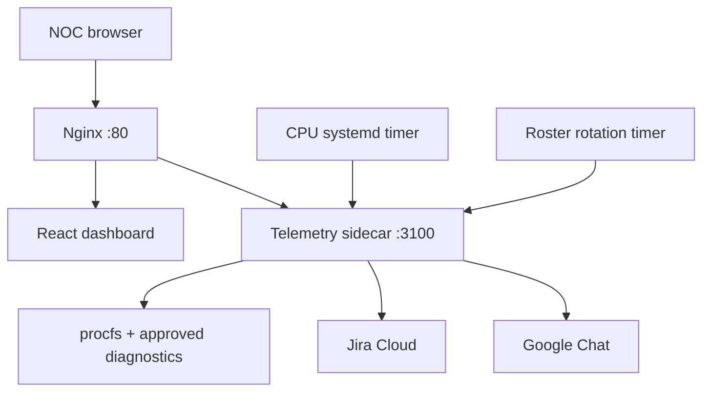

# OpsPilot

OpsPilot is a safety-first NOC operations console for a Linux VM. It combines
live telemetry, fixed read-only diagnostics, historical metrics, on-call
rotation, Jira incident creation, and Google Chat notification in one workflow.

This repository contains the complete proof of concept: the React dashboard,
Python telemetry sidecar, systemd deployment assets, roster automation,
sustained-CPU incident controller, tests, and the Jira custom-field migration
used by existing v0.9 installations.

> **Project status:** internal-lab proof of concept. It is not yet a production
> control plane for a large server estate.

## Architecture



Both Python services remain bound to loopback. Nginx is the only public
application listener.

## Capabilities

| Area | Implementation |
| --- | --- |
| Live telemetry | CPU, memory, disk, load, services, processes, users, sessions, mounts, and network state |
| Diagnostics | 171 exact-match, read-only Linux commands; no arbitrary shell endpoint |
| History | SQLite WAL telemetry with fixed 15m, 30m, 1h, 3h, and 6h ranges |
| Incident workflow | Draft-first Jira payload, explicit live-mode confirmation, action token, and idempotency ledger |
| Alert automation | CPU >= 90% for four checks; one incident until recovery below 80% for three checks |
| On-call routing | Three-shift Asia/Kolkata schedule with atomic CSV updates and full-day coverage validation |
| Notifications | Jira issue followed by Google Chat; partial success is recorded if Chat fails after Jira succeeds |
| Deployment safety | Checksums, syntax checks, loopback validation, backups, rollback, and systemd hardening |

## Repository layout

```text
opspilot-proj/
├── dashboard/                    React UI, telemetry sidecar, and VM deployment
├── automation/
│   ├── cpu-alert/                Sustained-CPU Jira controller
│   └── roster-rotation/          Asia/Kolkata on-call rotation
├── maintenance/
│   └── jira-business-unit-fix/   Migration for a required Jira select field
├── docs/                         Deployment, operations, and publishing guides
├── scripts/verify-all.sh         Repository-wide verification
└── .github/workflows/ci.yml      Python, shell, and frontend CI
```

## Verify locally

Requirements: Python 3.10+, Bash, Node.js 22+, and npm.

```bash
./scripts/verify-all.sh

cd dashboard/source
npm ci
npm run build
```

The frontend build is copied into `dashboard/files/` before a VM deployment.

## Deploy to an Ubuntu VM

Read [docs/DEPLOYMENT.md](docs/DEPLOYMENT.md) before installing. The short
sequence is:

```bash
cd dashboard
./deploy.sh
./configure-integrations.sh

cd ../automation/roster-rotation
./install.sh

cd ../../maintenance/jira-business-unit-fix
./verify.sh
./install.sh

cd ../../automation/cpu-alert
./verify.sh
./install.sh
```

Every integration starts in `draft` mode. Installation and validation perform
no Jira or Google Chat write. Live CPU automation requires the separate
`enable-live.sh` confirmation.

## Configuration and secrets

Use `dashboard/files/opspilot-integrations.env.example` only as a template.
Real credentials belong in:

```text
/etc/opspilot-dashboard/integrations.env
```

That file must be owned by `root:root`, mode `0600`, and must never be committed.
Do not commit Jira API tokens, Chat webhook URLs, action tokens, email addresses,
internal hostnames, private IP addresses, runtime databases, or live roster data.

## Operational evidence

```bash
curl -sS http://127.0.0.1:3100/healthz | python3 -m json.tool
sudo journalctl -u opspilot-dashboard-agent.service -n 50 --no-pager
sudo journalctl -u opspilot-cpu-alert.service -n 50 --no-pager
systemctl list-timers --all --no-pager | grep opspilot
```

See [docs/OPERATIONS.md](docs/OPERATIONS.md) for incident states, duplicate
suppression, recovery behavior, and rollback locations.

## Production gaps

Before using OpsPilot beyond a controlled lab, add HTTPS, user authentication,
RBAC, centralized inventory, per-node identity, audit-log export, secret-manager
integration, high availability, alert routing policy, and retention governance.

## License

No open-source license has been selected yet. Add a license before distributing
or accepting external contributions.
