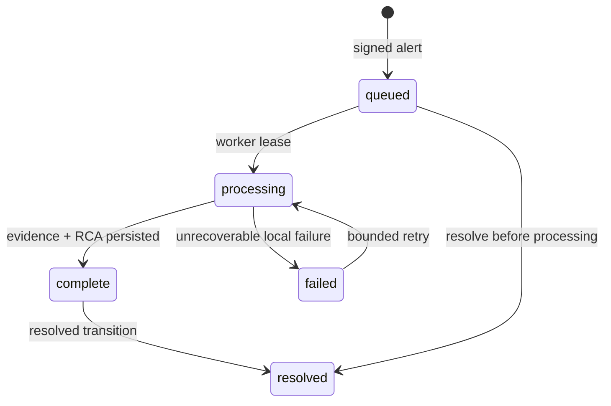

# Architecture and trust boundaries

## Control planes

| Plane | Components | Allowed behavior | Forbidden behavior |
|---|---|---|---|
| Ingress | FastAPI, HMAC verifier | Validate and enqueue | Slow collection, arbitrary commands |
| Evidence | Linux collector, router reader | Fixed read-only observations | Shell, model-selected commands, config changes |
| State | SQLite ledger, evidence files | Atomic append/update, hashes, leases | Secrets, unredacted outbound data |
| Analysis | BharatRouter LLM client | Strict advisory RCA | Tool calling, remediation execution |
| Delivery | Jira and Slack clients | Create/search/post bounded payloads | Blind retry after unknown outcomes |
| Remediation | Policy engine, fixed runbooks | Approved exact actions | LLM command text, unrestricted target values |

## Incident lifecycle

Delivery errors do not destroy an otherwise complete evidence/RCA package. Each destination has
its own state: `reserved`, `sent`, `failed`, or `unknown`. `unknown` prevents automatic replay.

## Evidence integrity

The evidence SHA-256 is calculated over canonical, redacted JSON. The same content is:

1. written atomically as deterministic gzip;
2. stored under a filename containing its digest;
3. referenced by the incident ledger;
4. included in Jira and Slack;
5. linked to the LLM prompt and response hashes.

This supports traceability, not nonrepudiation. For regulated use, add signed attestations, a
managed immutable object store, key rotation, and external time stamping.

## Flapping algorithm

For an exact `kind:node:resource:metric` key, transitions are ordered by UTC timestamp and row ID.
A cycle is counted only when a firing transition is later followed by a resolved transition.
Repeated firing notifications without a resolution do not inflate the cycle count. The default
criterion is five cycles in seven days.

## Horizontal scale

SQLite/WAL is suitable for a single-node control plane and a modest fleet. Worker leases support
multiple local worker processes, but SQLite is not a cross-region queue. At larger scale, preserve
the same contracts and replace:

- SQLite jobs with Kafka, SQS, RabbitMQ, or a transactional PostgreSQL queue;
- local evidence with immutable object storage;
- local collector calls with mutually authenticated node agents;
- file secrets with Vault/KMS/workload identity;
- single-instance API with an HA ingress and replay cache.

The LLM, Jira, Slack, telemetry, and RCA contracts do not need to change.

