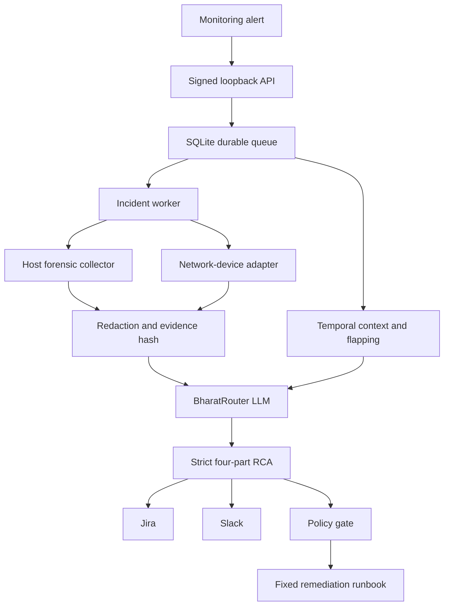

# OpsPilot Enterprise

OpsPilot Enterprise turns an infrastructure alert into a bounded forensic evidence package,
temporal correlation, a strict four-part AI-assisted RCA, incident-system updates, and an
optional policy-gated remediation. It is designed so that the LLM is never an execution
principal.

## Important BharatRouter distinction

The service shown in the supplied screenshot is **BharatRouter**, an AI inference gateway. Its
documented endpoint is `https://api.bharatrouter.com/v1/chat/completions`, using an OpenAI-compatible
wire format and a `br-...` Bearer key. It does not expose physical-router interface state.

This code therefore contains two deliberately separate adapters:

- `BharatRouterLLMClient`: sends the evidence-bound RCA request to BharatRouter.
- `RouterTelemetryClient`: reads interfaces from a real router/controller REST API using a
  configurable read-only API key, endpoint path, and normalization parser.

Do not point `OPSPILOT_ROUTER_BASE_URL` at `api.bharatrouter.com`; that is not a network-management
endpoint.

Primary references:

- <https://bharatrouter.com/docs>
- <https://api.bharatrouter.com/openapi.json>
- <https://developers.openai.com/api/docs/guides/structured-outputs>

## Capabilities

### Forensic telemetry

- Full process tree from `ps` including arguments.
- Independent `/proc` walk with the exact NUL-delimited argv, executable, working directory,
  UID/user, cgroup, parent chain, deleted executable marker, elapsed time, RSS, and sampled CPU.
- Kernel evidence from `journalctl -k` plus a best-effort `dmesg` snapshot.
- System journal, failed units, CPU, VM, memory, filesystem, inode, and block-device state.
- TCP/UDP socket ownership, socket summary, interface counters, addresses, routes, and network
  protocol counters.
- Fixed argument vectors, no shell, clean environment, process-group timeout, output caps,
  redaction, and per-command SHA-256.

### Synthetic test recognition

Known workload tools are detected before the LLM sees evidence:

- `stress-ng`
- `stress` with worker flags
- `sysbench ... run`
- `lookbusy`
- common CPU-burn binaries
- `fio` job invocations
- `iperf`/`iperf3`
- `openssl speed`
- `yes` as a lower-confidence signal
- named load-test scripts and interpreter busy loops with load primitives

A confirmed deterministic signature forces the final classification to
`manually_injected_load` and retains the exact redacted command. A model cannot relabel it as an
organic application failure. Conversely, the model cannot assert manual injection without a
qualifying deterministic finding.

### Temporal ledger

The SQLite/WAL ledger stores:

- incidents and firing/resolved transitions;
- redacted evidence hashes and envelopes;
- LLM provider, model, route, prompt version, latency, and outcome;
- delivery reservations/results for Jira and Slack;
- leased background jobs;
- router interface samples;
- remediation approval, change-ticket, request hash, and result.

Flapping is defined as complete firing→resolved cycles for the exact normalized resource key.
The default is five complete cycles in seven days. History supplied to the model is bounded to
7–30 days and a configured event limit.

### Network telemetry

`RouterTelemetryClient` supports:

- API-key headers such as `X-API-Key` or `Authorization`;
- an endpoint template such as `/v1/devices/{device_id}/interfaces`;
- bounded timeouts and retry/backoff for safe GET requests;
- normalization of common REST/SNMP-proxy fields;
- admin/oper state, speed, MTU, addresses, errors, drops, packets, and bytes;
- persistent samples and link-state transition detection;
- hardware flapping from the same temporal ledger used for server incidents.

The generic parser accepts common names such as `ifName`, `ifAdminStatus`, `ifOperStatus`,
`ifInErrors`, `ifOutErrors`, `ifInDiscards`, and `ifOutDiscards`. For a real vendor, add a focused
parser for its published schema and keep the normalized models unchanged.

### AI RCA

The master prompt treats every telemetry field as untrusted, enforces evidence hierarchy,
separates correlation from causation, applies explicit synthetic-vs-organic rules, and requests
exactly four operational sections:

1. Summary
2. Evidence
3. History
4. Resolution

The response is parsed into a strict Pydantic contract. Extra keys are rejected. The client first
requests strict JSON Schema output. If a BharatRouter route rejects that feature with HTTP 400,
it retries once in JSON-object mode and still validates locally. Provider failure produces a
deterministic, explicitly low-confidence fallback; confirmed synthetic evidence remains
high-confidence because it does not depend on the model.

### Delivery and idempotency

- Jira uses a stable event label and searches before create.
- A post timeout is reconciled through that label before the outcome is declared unknown.
- Slack webhook delivery has a ledger reservation. A timeout becomes `unknown` and is not blindly
  retried, because an incoming webhook has no reliable idempotency key.
- The database unique constraints prevent duplicate jobs, delivery phases, evidence rows, and
  remediation/change-ticket combinations.

### Remediation

Remediation is disabled by default. The LLM can recommend only a runbook ID; it cannot send an
executable command. The included state-changing runbook is intentionally narrow:

- `restart.allowed_service`

It requires:

- a completed incident and compatible RCA;
- an explicitly allowlisted systemd service;
- a change ticket;
- a separately signed, actor-bound, time-limited approval token;
- a successful `systemctl is-active` precheck;
- an exact `systemctl restart <allowlisted-service>` argument vector;
- a successful postcheck;
- an immutable remediation record.

Automatic mode additionally requires a high-confidence RCA, `automation_eligible=true`, and an
explicit auto-runbook allowlist. A manually injected load is never answered by automatically
restarting a business service.

## Architecture



The recommended production deployment separates the API, incident worker, and privileged
remediation executor. The included API process never invokes remediation on alert receipt.

## Repository layout

```text
src/opspilot_enterprise/
  api.py             signed FastAPI ingress
  cli.py             service entry points
  config.py          validated environment configuration
  evidence.py        atomic compressed evidence store
  factory.py         dependency construction
  integrations.py    Jira and Slack clients/payloads
  ledger.py          schema, history, jobs, idempotency, flapping
  llm.py             BharatRouter client and deterministic fallback
  logging.py         redacted JSON logs
  models.py          strict Pydantic contracts
  network.py         router REST client/parser/hardware flap detector
  orchestrator.py    end-to-end workflow
  prompt.py          master L3 prompt and strict schema
  remediation.py     fixed policy-gated runbooks
  security.py        redaction, hashes, webhook/approval HMAC
  synthetic.py       deterministic load-test classifier
  telemetry.py       Linux forensic collection
  worker.py          durable leased job worker
```

## Installation

Use Python 3.11 or newer:

```bash
python3 -m venv /opt/opspilot-enterprise/venv
/opt/opspilot-enterprise/venv/bin/pip install --require-virtualenv .
```

For development:

```bash
python3 -m venv .venv
.venv/bin/pip install -e '.[dev]'
.venv/bin/ruff check src tests
.venv/bin/mypy src/opspilot_enterprise
.venv/bin/pytest
```

## Configuration

Copy `config/opspilot.env.example` to `/etc/opspilot-enterprise/opspilot.env`, set root ownership,
and make it mode `0600`. Generate the webhook and approval HMAC secrets independently.

```bash
sudo install -d -o root -g opspilot -m 0750 /etc/opspilot-enterprise
sudo install -o root -g opspilot -m 0600 \
  config/opspilot.env.example /etc/opspilot-enterprise/opspilot.env
```

Never put API keys in alert labels, annotations, command-line flags, unit files, or Jira fields.

## Inbound alert contract

```json
{
  "schema_version": "1.0",
  "alert_id": "zabbix-78492011",
  "kind": "server_cpu",
  "state": "firing",
  "source": "zabbix",
  "node": "test-kcc-noc-vm",
  "resource": "host",
  "metric": "cpu.utilization.percent",
  "severity": "SEV-1",
  "observed_value": 99.4,
  "threshold": 90,
  "occurred_at": "2026-08-05T05:00:00Z",
  "labels": {"environment": "test"},
  "annotations": {"trigger": "CPU utilization sustained for 60 seconds"}
}
```

Sign the exact raw body:

```text
signature = HMAC-SHA256(secret, "v1:<unix_timestamp>:<raw_body>")
header X-OpsPilot-Signature = "v1=<hex_digest>"
header X-OpsPilot-Timestamp = "<unix_timestamp>"
```

`examples/send_signed_alert.py` implements this without placing the secret in the process list.

## Process execution model

Start the loopback API and worker as separate services:

```bash
opspilot-api
opspilot-worker
```

The API validates, persists, and returns HTTP 202. The worker claims a database lease and performs
the slower evidence and AI work. If a worker dies, another worker can reclaim the job after the
lease expires. An exact duplicate occurrence returns HTTP 202 but creates neither a second job nor
a second delivery.

For router polling:

```bash
opspilot-router-poller --interval 30
```

Each changed interface state creates a normalized firing/resolved event. Unchanged polls create a
sample but not a duplicate transition.

To import the prior PoC ledger once, after backing it up and while the old writer is stopped:

```bash
opspilot-import-legacy-ledger /var/lib/opspilot-live/incidents.json
```

The importer is idempotent by alert ID. It does not delete or rewrite the source JSON.

## Storage

Default locations:

- `/var/lib/opspilot-enterprise/opspilot.sqlite3`: temporal ledger, job state, delivery records,
  hashes, normalized incident metadata, and remediation audit.
- `/var/lib/opspilot-enterprise/evidence/YYYY/MM/DD/*.json.gz`: redacted, compressed,
  content-addressed forensic envelopes.
- system journal: API/worker runtime logs in redacted one-line JSON.
- Jira: human-facing incident and four-part RCA.
- Slack: notification/collaboration copy, not the source of record.

The application does not implement a universal retention deletion policy because retention is an
organizational/legal decision. Apply a documented policy to evidence files and database backups;
do not delete active incidents merely to control disk use.

## Production gates

This code is production-oriented, but a safe production rollout still requires environment facts
that code cannot invent:

1. The real network controller's documented URL, schema, authentication, certificate chain, and
   read-only role.
2. Jira project field requirements and an account restricted to that project.
3. Slack webhook/channel ownership and data-retention approval.
4. BharatRouter model choice, budget, residency, and organizational DPA/DPDP review.
5. Host permissions sufficient for `/proc`, journal, `ss -p`, and network counters without broad
   root access.
6. Evidence retention, encryption-at-rest, backup, and restore policy.
7. Runbook owners, approved services, change controls, rollback behavior, and blast-radius limits.
8. Staging tests with real alerts, provider failure, partial evidence, worker crash, Jira timeout,
   Slack timeout, and duplicate replay.

Do not describe any build as “zero risk” or “flawless.” Production diagnostics consume resources,
third-party APIs fail, and AI conclusions are probabilistic. The correct enterprise claim is:
bounded, read-only investigation; deterministic synthetic detection; evidence traceability;
failure isolation; and policy-gated state changes.
